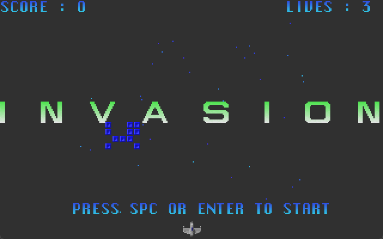

# Invasion
Welcome to Invasion, an action-puzzle game similar to Quarth (or Block Hole), written in Pascal. The puzzle mechanics are slightly different than Quarth, as this was an attempt at a free shapes kind of game mode.

This one was made in 1996 and is a collaboration with Stelian "Steli" Serban doing the artwork. It also features a new medieval-themed Wings of Sorrow logo, made by him.

Can't remember where I got the music from.

This was my most polished game but also the last "casual" game as a solo dev for quite a while. Around that time I've started to pursue more seriously graphics programming and making [demos](https://github.com/stefandee/demos_and_intros), then tried my hand at a bigger game production, an arcade flight simulator called [Skyborg](https://github.com/stefandee/skyborg)

Looking at it after ~30 years, it would take just a little bit of additional polish to put it over the finish line.

It was never released publicly.

## Gameplay Instructions
Use arrows to move, space to shoot and fill blocks at the yellow arrow.

Goal is to create 2x3/3x2 or bigger blocks and leave just "hanging" blocks. 

It lacks indication on what is a "harmless" blocks configuration and it's very difficult from the get go.

## Media

## Setup&Install&Build (original, DOS)
Turbo Pascal/Borland Pascal is needed to build it.

## License

Code license:
https://opensource.org/licenses/MIT

Artwork:
https://creativecommons.org/licenses/by-nc-sa/4.0/

